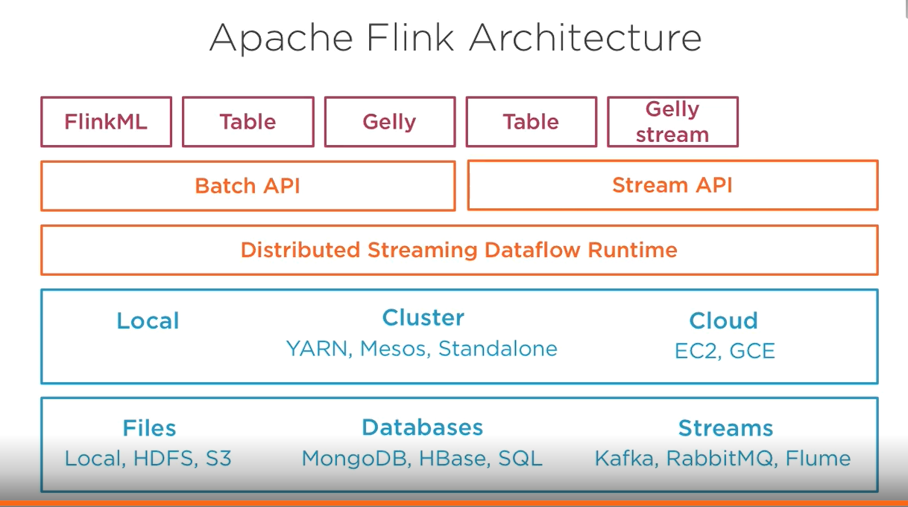
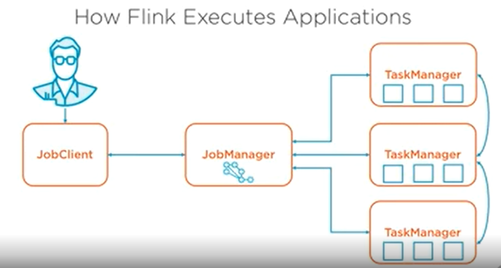

# Apache Flink
Big Data Vs
* Velocity
* Volume
* Varity

## History
* Google had Google File System and MapReduce
* Yahoo started using open source Hadoop.
* Hadoop
    *  Name node - Tracks where file is distributed
    *  Data node - Stores file chunks and processes map and reduce function
    *  Has replication support
    *  Supports batch processing
* Apache Spark
    *  3rd Generation Big Data tool
    *  Supports both batch and stream processing
    *  Instead of MapReduce a two operation model it has operators model.
    *  Direct Acyclic Graph of operators to perform on data.
    *  Operators has more flexibility.
    *  Processing in memory so faster than Hadoop 100 times.
    *  Batch processing supported and stream processing is special case of batch processing
    *  Stream is divided into chunks and processing them in batches
* Apache Flink
    *  4th generation Big Data tool
    *  First class support for stream processing
    *  Batch is special case of stream processing, batch as a final stream.
    *  Flexible windowing by time or other attributes
    *  Custom, Overlapping windows supported
    *  Iterations supported
             * Define some operations on some data over and over again until some condition
             * More like a loop
    *  Own Memory management
    *  Faster
    *  Exactly once processing guarantee
    *  Query optimization

## Batch Processing
* Read data from sources with adaptors process over flink and write to destinations.
* Flink DataSets
    * Handle for Data containing data of same type
    * Immutable
    * Data transformation using stream operators
    * Representation of distributed data.
* ExecutionEnvironment class
* Reading data
    * Eg readCsvFile
    * readTextFile
    * fromCollection/fromElements (testing)
    * readFile(inputFormat, file) read fileusing a custom FileInputFormat type
    * Readinput(inputFormat) Read data from a custom data source
    * DataSet<Integer> ds = env.fromElements(1, 2, 3);
* Transforming data
    * Operators
    * Like
         * Map
         * Filter
         * flatMap
         * groupBy
         * Methods on DataSet
         * Join
         * Cross
         * OuterJoin
    * Writing data
         * writeAsText
         * writeAsCsv
         * Print / printToErr
         * Write
         * Output
         * Collect into java memory list
         

          
## Sorting
* Flink does not support global sorting as data is partitioned over task managers
* To find top 10 movies
    * Partition data across different task managers
    * Each task manager finds top 10 movies locally
    * Send result from these task managers into new task to find top 10



## Running a job from Fink UI
* Locally start flik
* Goto UI
* Have a job's jar file
* Make job take parameters using ParameterTool
* Upload new job as new jar
* Provide class with main method
* Provide parameters as : --input value --anotherinput value2

## Stream Processing
* StreamExecutionEnvironment
* Reading
    * readTextFile - File or distributed file
    * fromCollection fromElement
    * socketTextStream
    * addSource
         * Connector to external service like kafka, rabbitMQ
* DataStream instead of DataSource
* Processing
    * Map filter flatMap
    * Between streams
         * Uninon
         * Split
         * connect
* Windows
    * Dividing infinite stream info finite blocks called windows
    * Window by time, number of elements or other ways
* Write
    * writeAsText
    * Print
    * printErr
    * addSink - Add to external Source
	


Flink can devide Stream into windows for processing
Two types of windows:
1. Non Keyed Window
    - Elements are grouped into chunk of finite elements
    - Not processed in parallel
2. Keyed window
    - Elements are grouped into streams to be processed as new stream
    - Parallalism
3. Window Assigner
    - Tumbling by time:
        - All elements coming in, within some time frame go together
    - Tumbling by Size
        - Elelement groups of some size go together.
        - If lesser elemens are in waits for number to be fulfilled
    - Sliding
        - Window of some time is started, then it slides by some time unit
        - Eg. Window size is 10 min and it slides by 5 minutes
        - Then first group is 0-10minutes then 5-15min then 10-20 min etc
    - Session
        - Elements coming in at close time are grouped together
        - On inactivity of stream, group is closed and on new activity new session window created
    - Global
        - Single window
			
			
Stream window processing creates new stream
* Reduce/fold - Aggregation
* Min/max/sum - operations in window
* Apply - generic function

```Java
DataStream<Tuple2<String, Long>> str;
DataStream<<Tuple2<String, Long>> res = str.keyBy(0)
			.timeWindow(Time.minutes(10))
			.max(1); //Stream of key and max value every 10 minutes
```

Non Keyed window
```Java
DataStream<Long> str;
	Str.timeWindowAll(Time.minutes(10))
	.reduce(function) // all elements are processed by single Flink task.
```

Time
* Time concept for windowing used by Flink
* Processing time - Time on machine where it is being processed
* Event time - Time on system when event was generated at source
* Ingestion time - Time when element was received in cluster
* Time can be set at Environment

If we use Event time, it could happen that event was sent with time but did not reach cluster in time window
Such "Late" events will be ignored
Can set allowedLateness() on stream window. For that time lateness will be allowed.


## State management 
* Two types of state
    * Keyed: State is related with on key in keystream
    * Operator: For one operator
* ValueState value, update single value
* ListState get add list of values
* ReduceState get add  aggregate multiple values with reduce function
* FoldState get add aggregate multiple values with fold with fold
* methods
    * new RichMapFunction
    * new FlatMap 
    * new RichFilter
* In field of Above Anonymous classes
    * ValueStateDescription<Long> sum = new..
    * Inside function like map
        * getRunTimeContext().getState(sum).`[`value update`]`()

* Control Stream Pattern
    * Another stream has events to depict how application should behave
    * You will have to process both streams,
    * Main stream has data to process
    * Control stream has data to decide what to do
    * State Management is must for this ?
    * Connect operator to connect main and control stream
    
* nc command to connect to socket $nc -l port

* RichCoFlatMapFunction has to Map functions, one for each stream control and main
    * Control map function will capture changes and update ValueStateDescriptor
    * And main map function will use that info to act accordingly
	

* Future Topics to Cover
	* Table api -  Data processing with SQL like language
	* Other Language API
	* Flink with YARN or Mesos like Resource Management Tools
	* Graph processing gelly
	* Flink ML
	* [Complex Event Processing CEP](https://ci.apache.org/projects/flink/flink-docs-release-1.10/dev/libs/cep.html)
	* Checkpoints and save points
	* Kafka Integration 

